## [PDF version](Anubis_Android_Malware_Analysis_Report.pdf){:target="_blank"}
## Introduction

Anubis is one of the most well-known malware in the Android Malware family. It's still popular for threat actors today, given its capabilities and the damage it has done to andorid users in the past. On the other hand, it offers many Malware Developers the opportunity to sample their abilities to create a new malware.

It is possible to find thousands of different Anubis samples produced to date on platforms such as **_Koodous_** and **_Abuse.ch_**. Basically, we can say that Anubis consist of 2 stages. Let's take a look at these stages and what they do.

##  Two Stages Of Anubis

Threat actors, if they plan to present the Anubis through a legit application such as Google Play, they use the application we will call Dropper at this point. Dropper's task is to download and install the real Anubis malware on the device from the moment it starts working. On the other hand, in scenarios where threat actors plan to spread Anubis through websites, fake campaigns or fake gifts, we can see that they share the Anubis application directly without using Dropper.

## Droppers

As it seems, Droppers try to mislead their targets by imitating other popular legitimate apps on Google Play.

Dropper apps should attract as little attention and be silent as possible to evade Google Play security services. For this reason, Droppers' abilities are very limited. It will be more than enough for threat actors to install Anubis on the target device in the safest way possible. So how can Dropper applications install Anubis on the device? Let's take a look at this together.

`REQUEST_INSTALL_PACKAGES`, the first red lights that appear with the sunrise, our hero who first greeted us when we started our story.

With this permission Android applications can obtain the ability to install an external application on the device.

And thus, Anubis malware is successfully installed on the device. As we mentioned above, Droppers imitate legitimate apps on Google Play to hide themselves and gain trust. On the other hand, Anubis do nearly same things with Droppers. It uses the current pandemic process and the impact of this process on society in order to hide itself and gain trust. Application names such as **_Pandemic Support_**, **_COVID-19 Support_**, **_2000 Turkish Lira Support_**, **_Pandemic Support Application_** and emblems of official ministries are widely used at this point.

{:width="27%"}
{:width="25%"}
{:width="45%"}

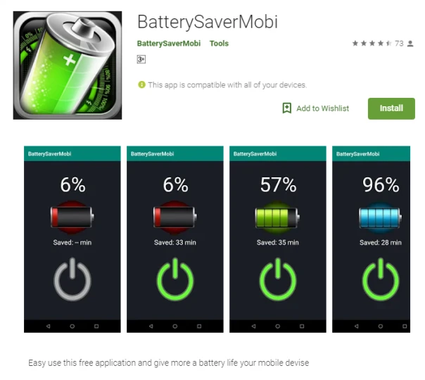{:width="47%"}
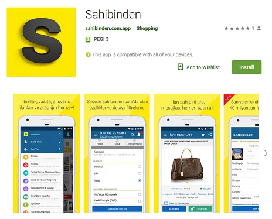{:width="52%"}

## Checksums

| **App Name**     | Her Aile'ye 2000 TL Pandemi Devlet Desteği | 
| **MD5**          | e2ebf224ef23e5d01a88e6bd06d6ad0   | 
| **SHA-1**        | defb1558ddc36fd10050f2cd65617dce7274dc01      | 
| **SHA-256**      | a0eb4e0e7346422d18d3421d1f185fcb2b01ac3080ab3b3bc68d67aab1f4477d | 


## Static Analysis

The first thing we need to look at in the static analysis section will of course be the permissions requested by the application in `AndroidManifest.xml`.  

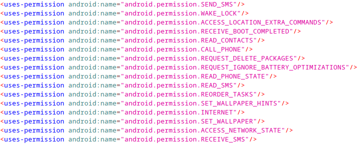

Frankly, many mobile malwares are giving themselves away at this point, we can say that application permissions are just one of the cornerstones of this business. Likewise, Anubis gives us the chance to guess what it can do with so much power it wants, but in the following parts of our article, we will see that Anubis is actually a Malware that contains more than we think. If we need to give an example, we can make a few statements on `RECEIVE_BOOT_COMPLETED` among the permissions requested. Thanks to this reciever permission, android applications can run in the background while the device is starting up and ensure its continuity on the device, and in the scenario we see, we realize that this permission is also on the list of requests by Anubis.  

One of the features we are used to seeing in many mobile malware is runtime class loading. When we continue to examine our `AndroidManifest.xml` file, it is possible to see that the classes that are not in the activity section are listed. From now on, it is certain that Anubis will do something to load the lost classes as it starts up.

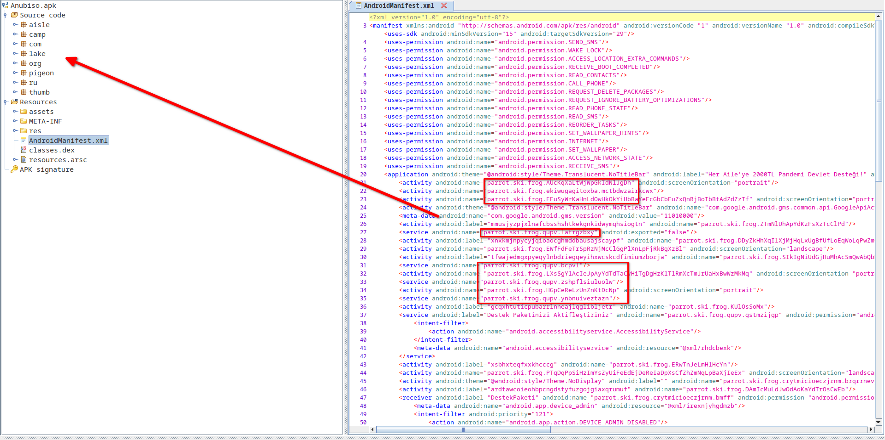

There are multiple ways to access our classes that will be loaded later, in our report we will refer to class loader function hooking and manual unpacking methods. For our static analysis, we will reach our classes that will be loaded later by hooking the `dalvik.system.DexClassLoader` function, but in the last section, we will aim to reach these classes with manual unpacking.

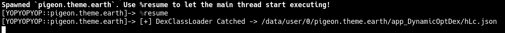


**BINGO!!!** Our dex file, which is wanted to be loaded using the `DexClassLoader` function, is right here, and the classes it contains are the lost classes that appear in the `AndroidManifest.xml` we mentioned above.

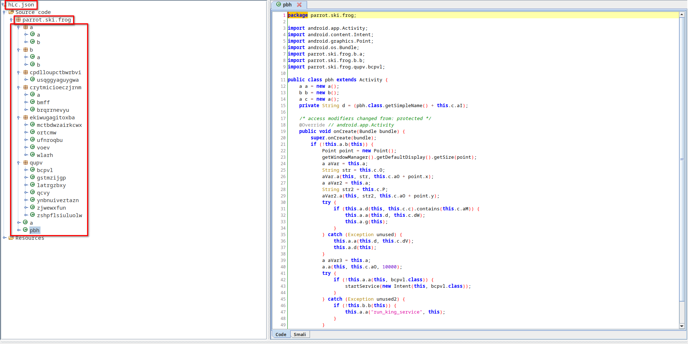

In fact, when we first open the **_hLc.json_** file, we realize that there are dozens of unnecessary `enum` classes added for obsfucation purposes, but [eybisi's jadx fork](https://github.com/eybisi/jadx){:target="_blank"} allows us to easily eliminate this problem with its **_Hide Enum Classes_** feature.


When we examine our loaded dex file and the classes in it, we are faced with many strings encrypted in the `parrot.ski.frog.a` class.

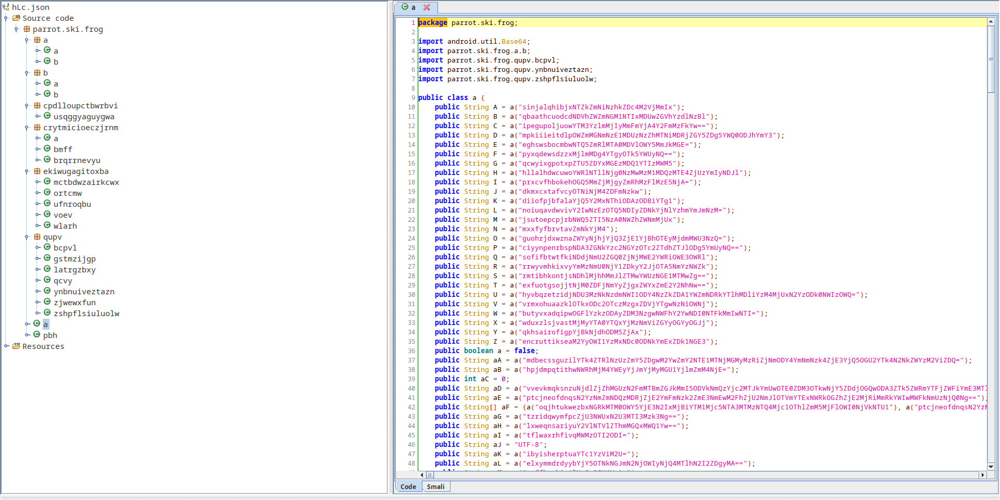


### String Decryption

Looking at our encrypted strings, we see that they all go to the `a(String str)` function before being defined to any variable. When we examine this function and code flow, we are faced with a process that we are familiar with.

**_RC4+BASE64_**

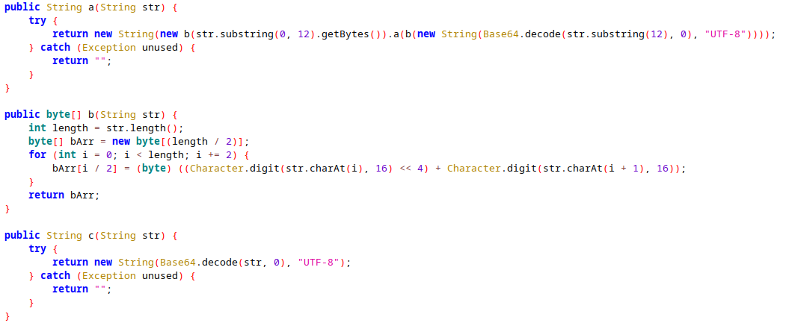

With our decryptor function, our encrypted string is first divided into 2 parts, the first 12 characters of these parts are used as the decryption key and the remaining expression is used as chipertext.

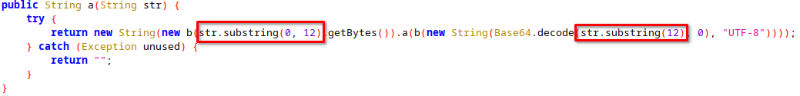

After our string, which is divided into 2 parts, is converted to the appropriate format, it is sent to our **_RC4_** function.

Anddd Here Is The Our **_RC4_** Implementation Function

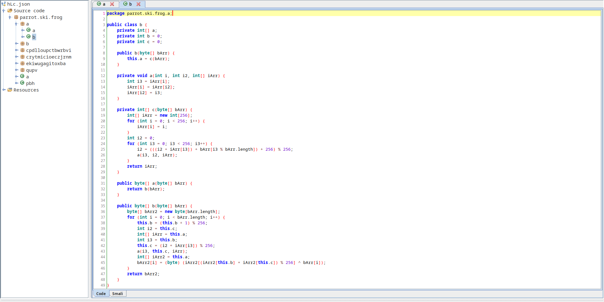

Anubis uses these ecrytped strings that we see in runtime by decrypting them. Come on now, let's look at the contents using the script I wrote to decrypt all the strings here and when we look at the outputs, we can reach more detailed information about the capabilities of Anubis, each of our decrypted strings here are very important, but I marked a few of the first ones that caught my attention.

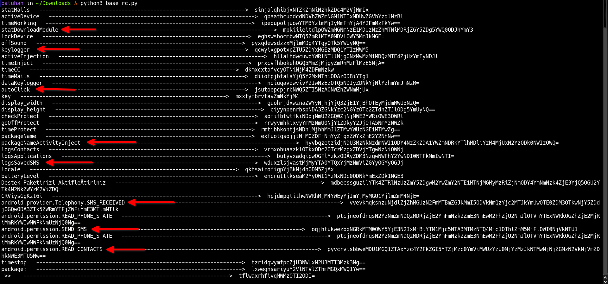
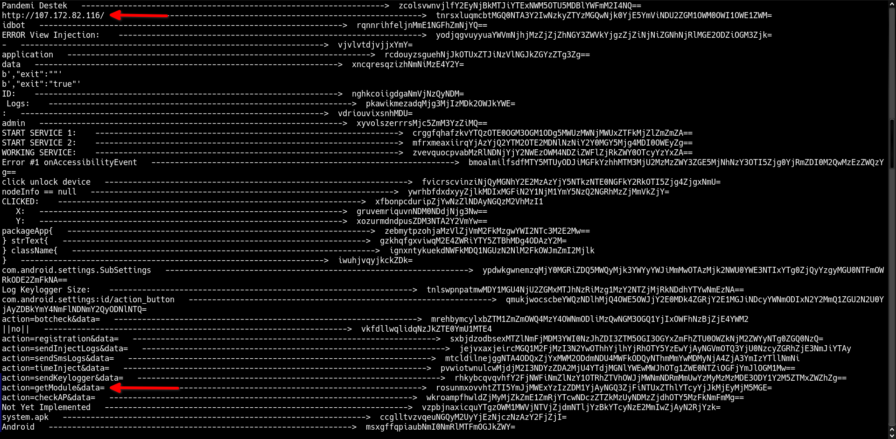
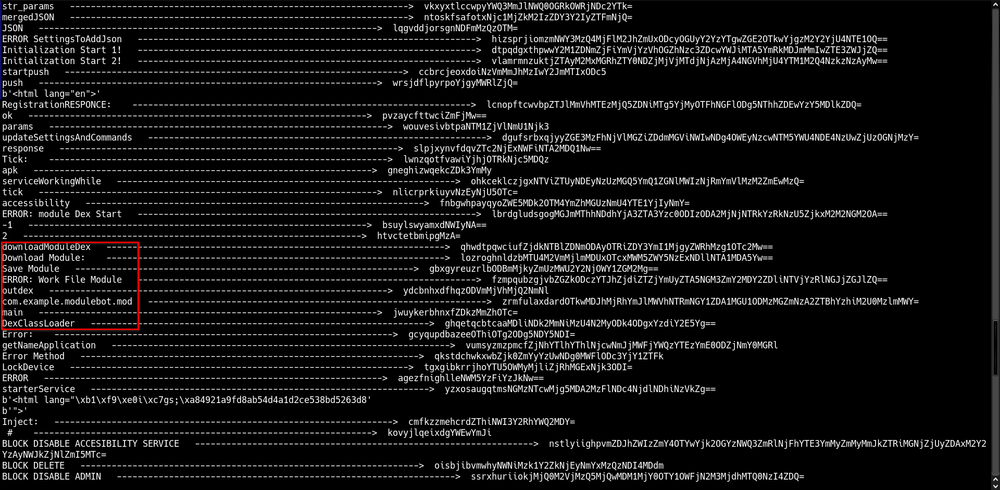


When I examined the strings we decrypted, I realized that some of them were just defined and never used again. First, I thought that the variable that the string is connected to would be a decryption result. But I couldn't find any function of this type, then I came across `DexClassLoader` in strings :D

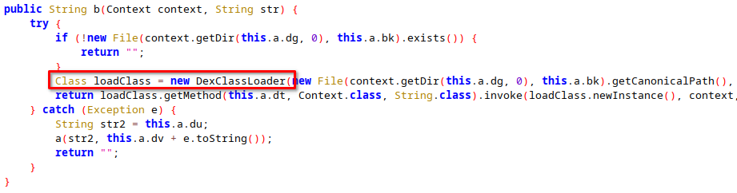

```java
String str2 = this.a.du; // this.a.du = DexClassLoader
```

The sample we examined loads the module it received from the C&C Panel with the `action=getModule&data=` request in runtime using `DexClassLoader` and runs the class it loaded with `com.example.modulebot.mod`, which I encountered in strings. There are multiple unused strings inside, including those with the package names of applications such as **_Telegram, Whatsapp, Tencent, Ubercrab, Viber, Snapchat, Instagram, Twitter_**.

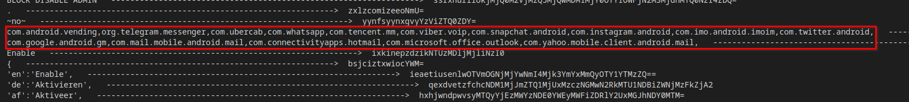

Since C&C Panel is not active, I could not examine the module to be loaded in runtime, but there are many harmful activities that can be mentioned in the classes we have. To mention them in order;

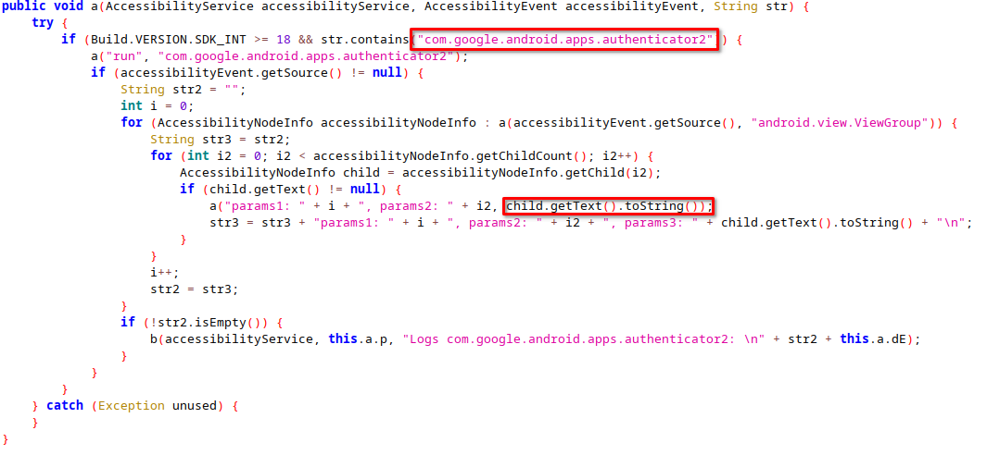

Anubis can steal 2FA code with using Accessibility events `getText()` function.

In addition, with Accessibility privileges, Anubis can also give itself any permission it wants.

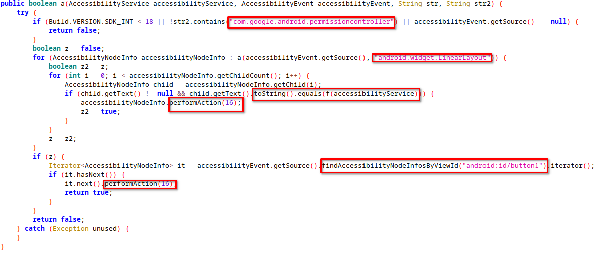

Here I would like to point out a few things about the `performAction(16)` function. Thanks to the accessibility permission, Android applications can click the buttons that appear on the screen.

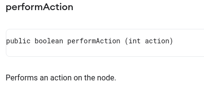{:width="45%"}
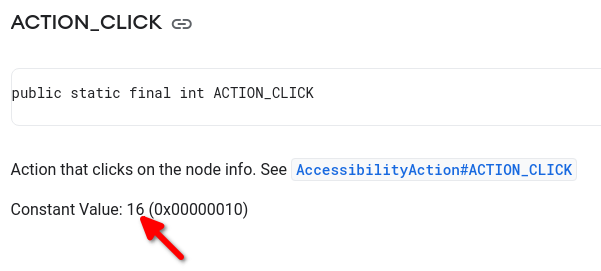{:width="45%"}

After the application starts working, it makes the necessary preparations to convert the basic information about the device and critical information such as **_statBanks_**, **_statCard_** into Json format.

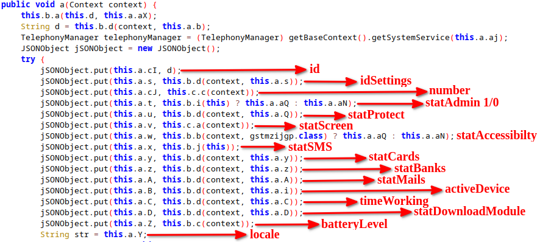

While examining `AndroidManifest.xml` file, we saw the permissions such as `SEND_SMS`, `READ_SMS`, `RECEIVE_SMS` in its content, but it seems that Anubis does not want to be content with them. It is thought that the purpose of Anubis, which wants to be the SMS application of the device, at this point is to delete the incoming messages in order not to leave any evidence behind.

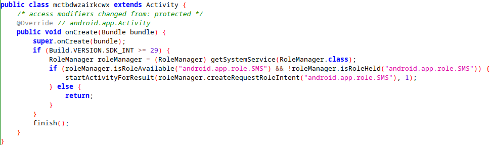


When Anubis first runs, it uses Shared Preferences to reuse the encrypted strings in its content.

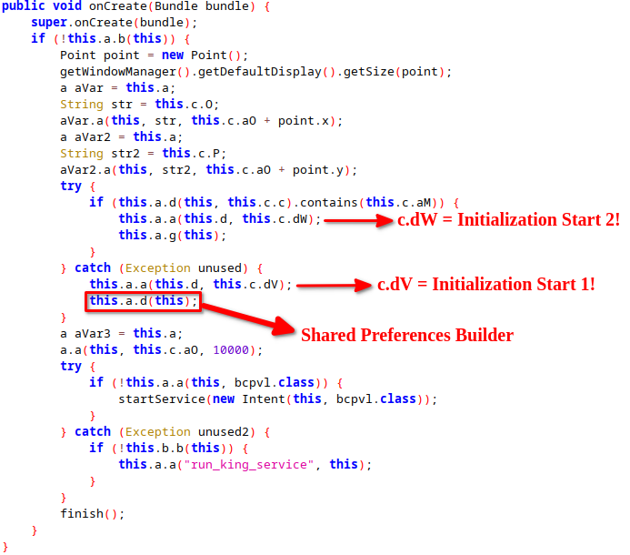
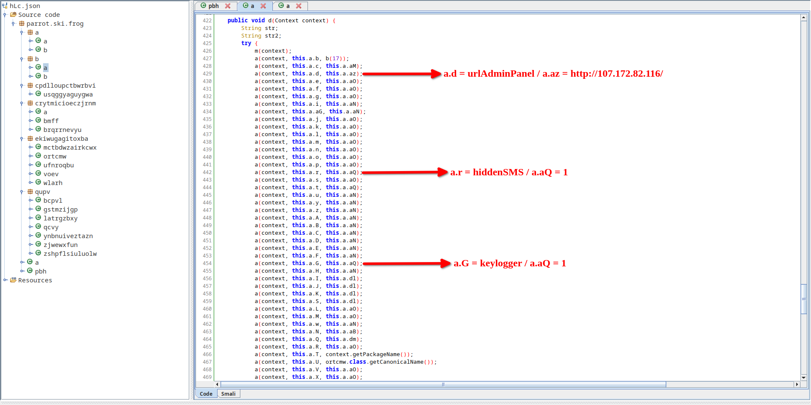

As can be seen above, certain information is kept in the **_key-value data_** format for later use.

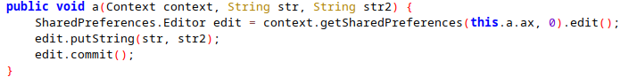

With many functions and endless loops in Anubis content, it causes a workload on the device where it is constantly loaded. Since one of the results of this workload is high energy consumption, Anubis' developers aimed to overcome this problem with the `REQUEST_IGNORE_BATTERY_OPTIMIZATIONS` permission.

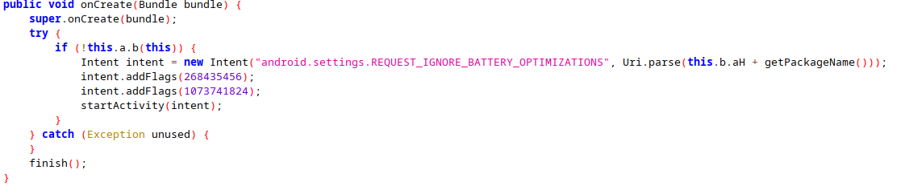
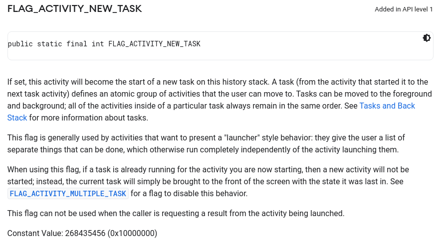{:width="38.5%"}
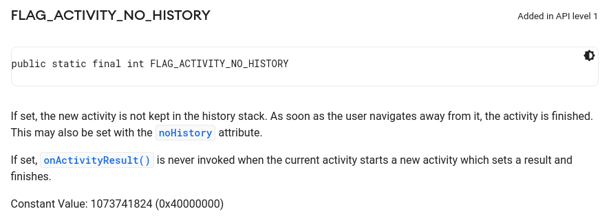{:width="60%"}

The application can reveal multiple amazing abilities with Accessibility permissions on the target device. For example, it can turn off Play Prottec to avoid being caught and prevent any attempt to delete itself from the device, again thanks to Accessibility.

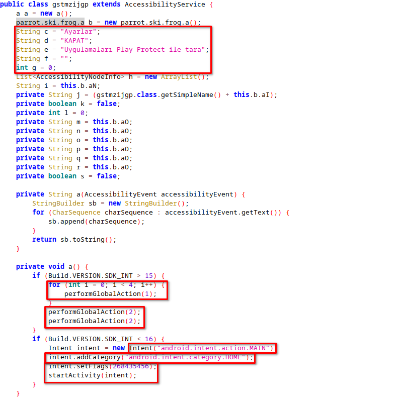

In the code block we saw above, it can perform operations with 1 and 2 constants from the `a()` function and the `performGlobalAction` function. Well, if you were to ask what operation these 1 and 2 correspond to, here is the answer;

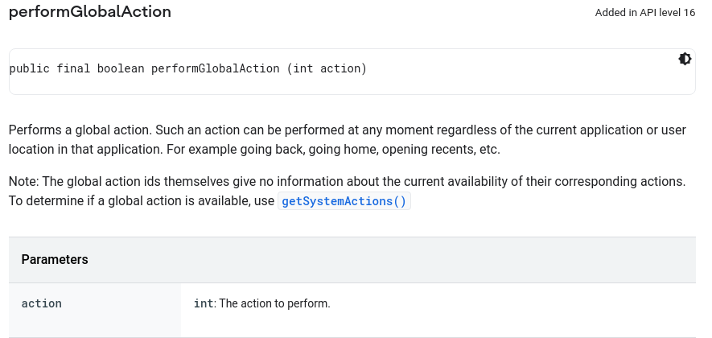{:width="44.7%"}
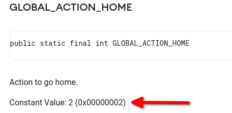{:width="43.5%"}
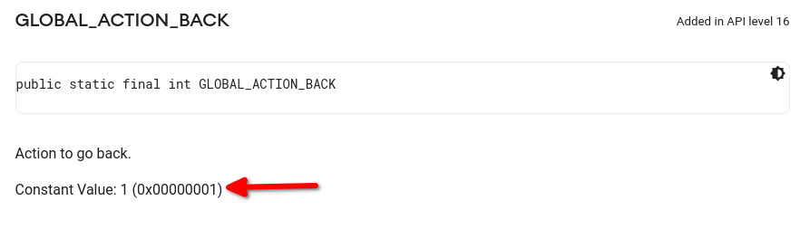

In addition, we need to mention that the developers of Anubis paid attention to important details such as the **Build SDK version** and implemented the escape function separately for **lower SDK versions**.

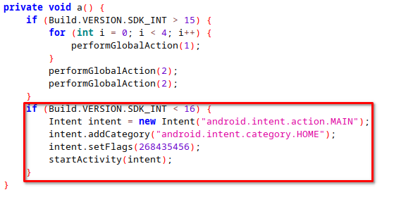{:width="46%"}
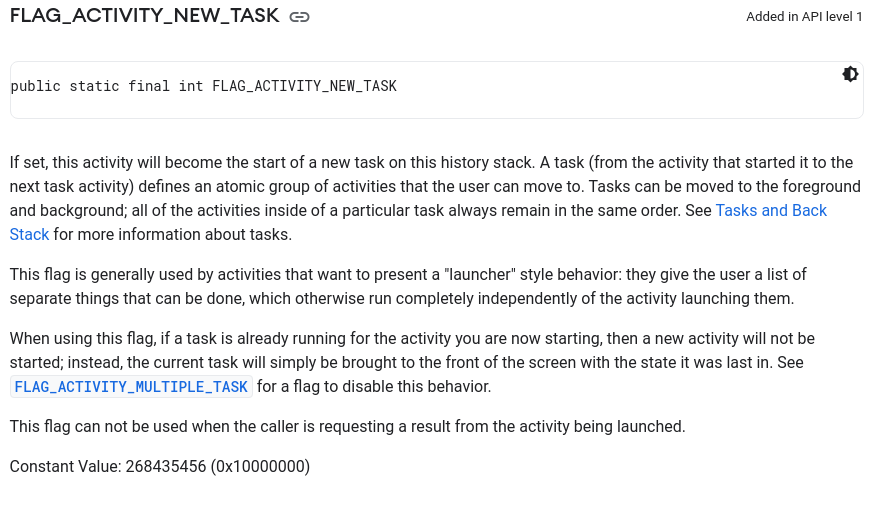{:width="40%"}

Anubis uses this code block against any deletion attempts of the user and returns the user directly to the main menu from where they are :D, it must be very annoying.

As an example, let's examine the code block below

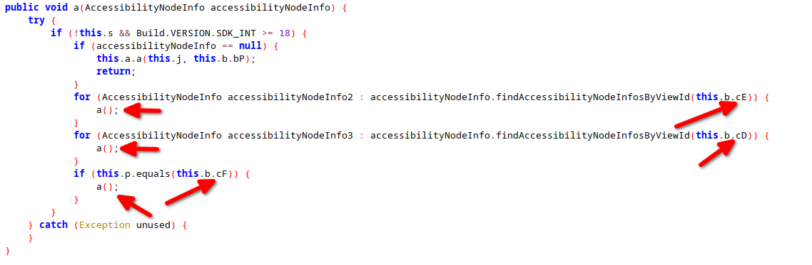

**cE =** com.android.vending:id/toolbar_item_play_protect_settings     
**cD =** com.android.vending:id/play_protect_settings  
**cF =** com.google.android.gms.security.settings.verifyappssettingsactivity  

Thanks to its accessibility ability, Anubis can infer what the user is doing on the screen at that moment, and runs the `a()` function directly in any scenario that will harm it. As we can see in our example code block, if it detects any of the **_cE / cD / cF_** string constants, the escape function `a()` will run directly.


## Dynamic Analysis

In our sample, we come across the application under the name of **_2000 TL Pandemic State Support for Each Family_** and using the emblem of the Ministry of Health of the Republic of Turkey.


With Anubis running on the target system, we see that the first thing it wants from the user is **_Accessibility_** privileges. Because many simple but effective abilities (**_Clicking Buttos_**, **_Scorlling Pages_**, **_Reading Windows Context_**) that the malware basically possesses are hidden behind these powers. On the other hand, we see at the beginning of our analysis that Anubis also uses a way to hide its icon from the app launcher in order to make it difficult to remove it from the device when it starts running.

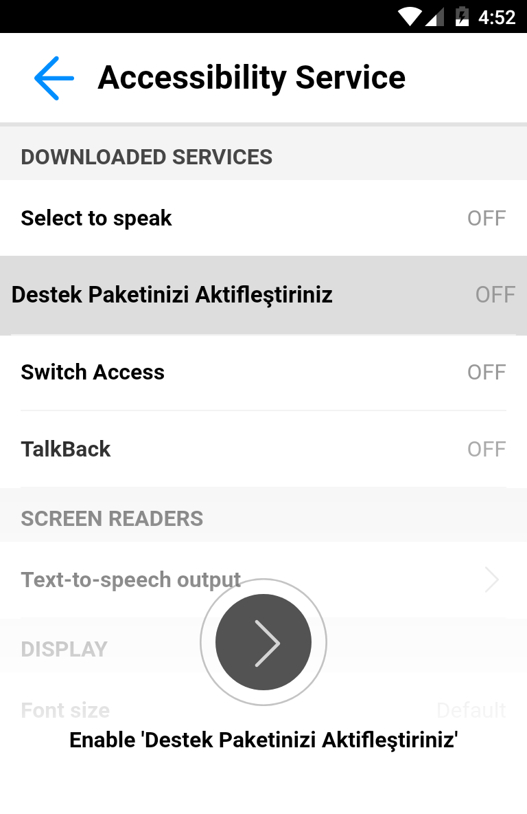{:width="22%"}
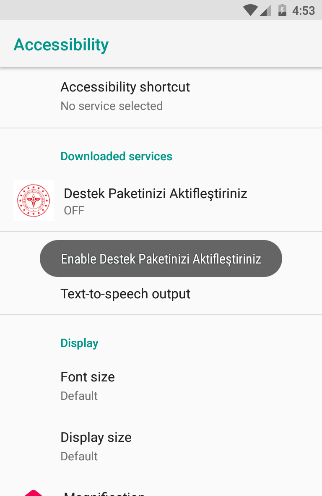{:width="22%"}
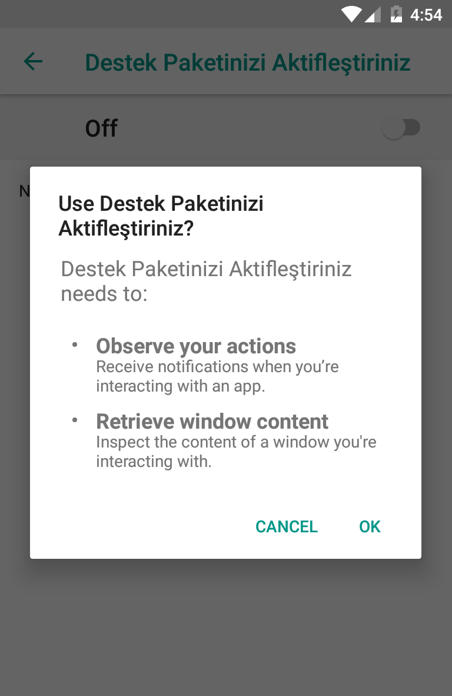{:width="22%"}
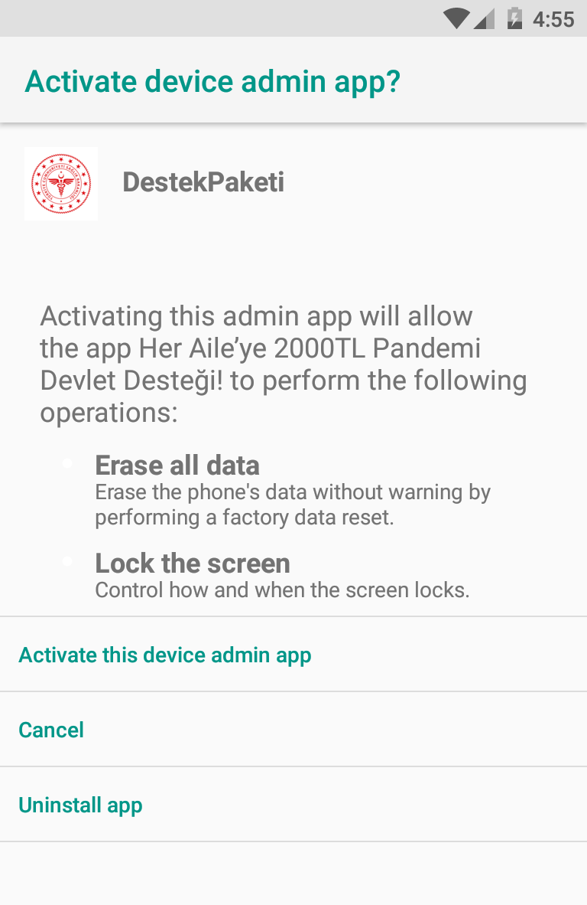{:width="22%"}

Let's give all permissions and examine what Anubis sent to C&C. Since our C&C Panel is not active during the analysis process, Anubis cannot receive any response from the C&C Panel.

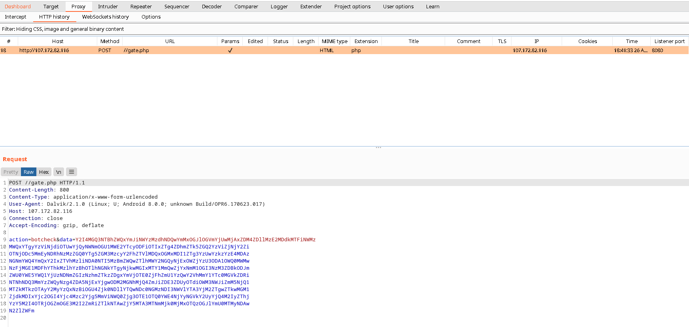

We talked about the **_JSON_** files created during the initialization phase in static analysis. Another detail I noticed during the static analysis was that Anubis encrypts the **_JSON_** files it prepares to send to the C&C Panel using **_Base64_** and **_RC4_**. But I thought it would be more accurate to mention this part here. Let's see what kind of code block Anubis uses for this process.

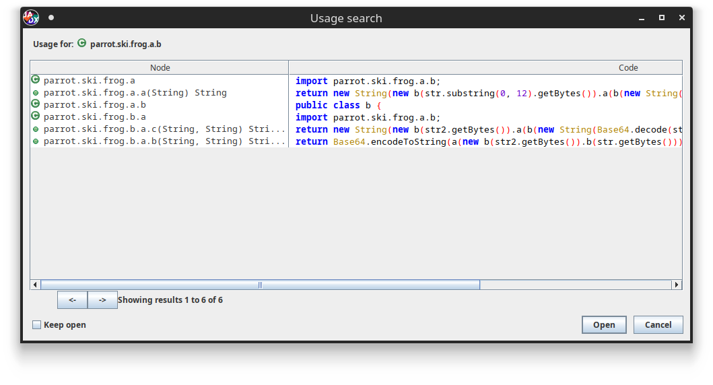

When I looked at the places where the **_RC4_** implementation in the application is used, I noticed that it is used in an additional place, not just for hard-coded strings. Then I started to examine this structure.

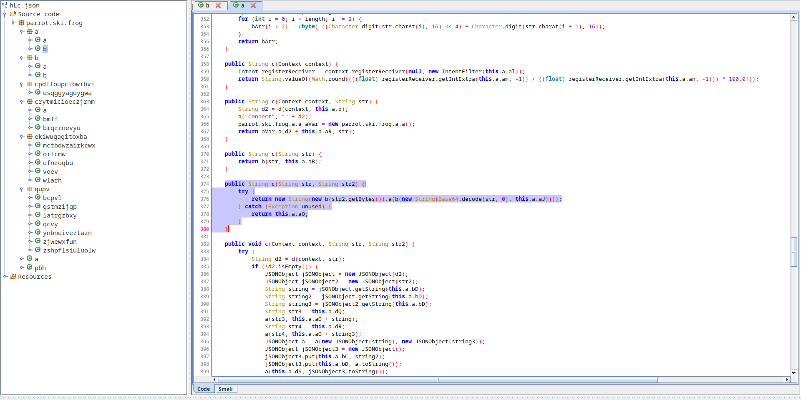

Do you think it is a coincidence that it is so close to **_JSON_** data :D ?

As we can see the function takes 2 Strings (str,str2). While `str2` is used as encryption key, `str` has data in **_JSON_** format.

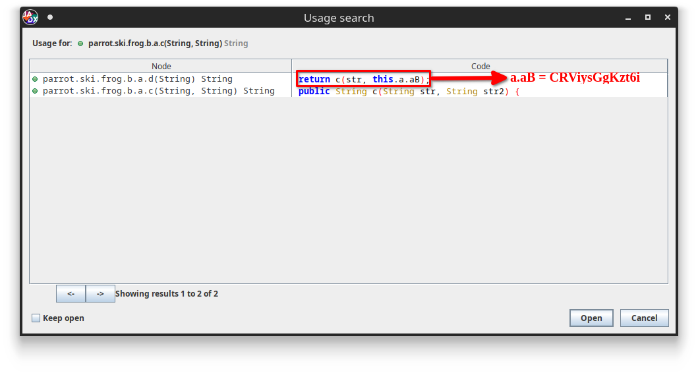

**Request Encryption RC4 Key** = `CRViysGgKzt6i`

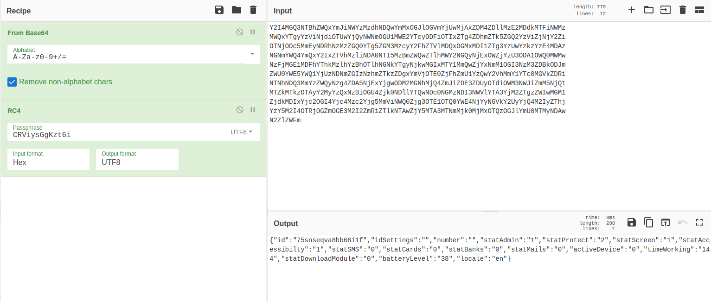

**YAY !!!**

## Manual Unpacking

At the beginning of our report, we mentioned that the sample we examined loads a class in runtime. We hooked the `DexClassLoader` function to find this loaded class. But we can also do this manually. In this way, we will discover how packers, which are used extensively in the Android Malware world, do this job. First, let's look at our `AndroidManifest.xml` file.

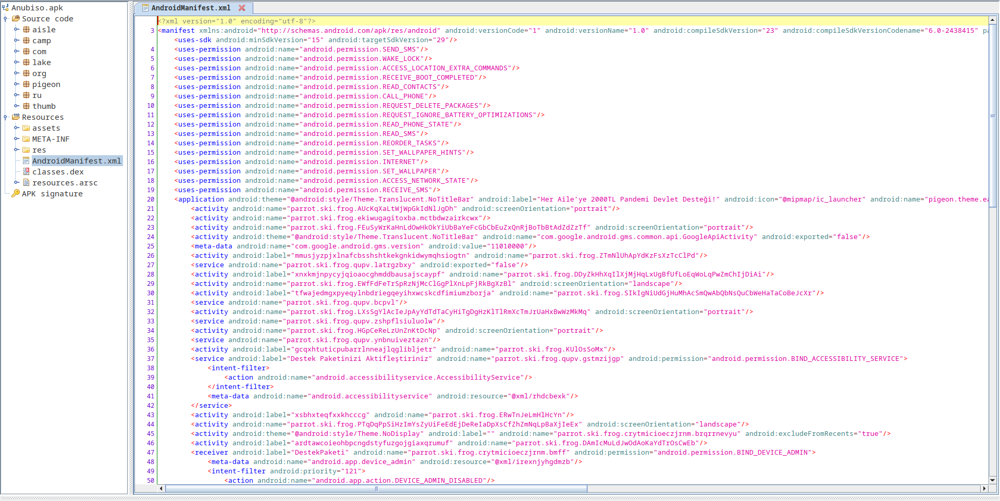

As we can see, all activities including `MAIN` are called under the `parrot` package, but we don't have the `parrot` package in sight. How is this possible?

This packer, which is widely used among Android Malwares, loads all the lost classes by using the class under the application tag.

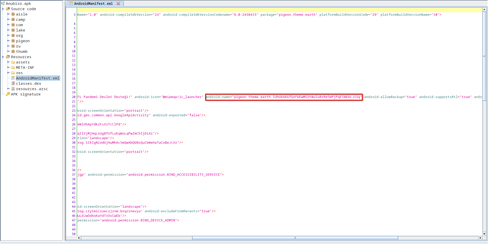

Although it appears to be full of classes that we do not have, we actually have the first class that runs and takes on the unpacking task.

`pigeon.theme.earth.IUhUkAkGfQxFbEwMiUtWuIuBrReSmPjPqEiWkAcJiSq`

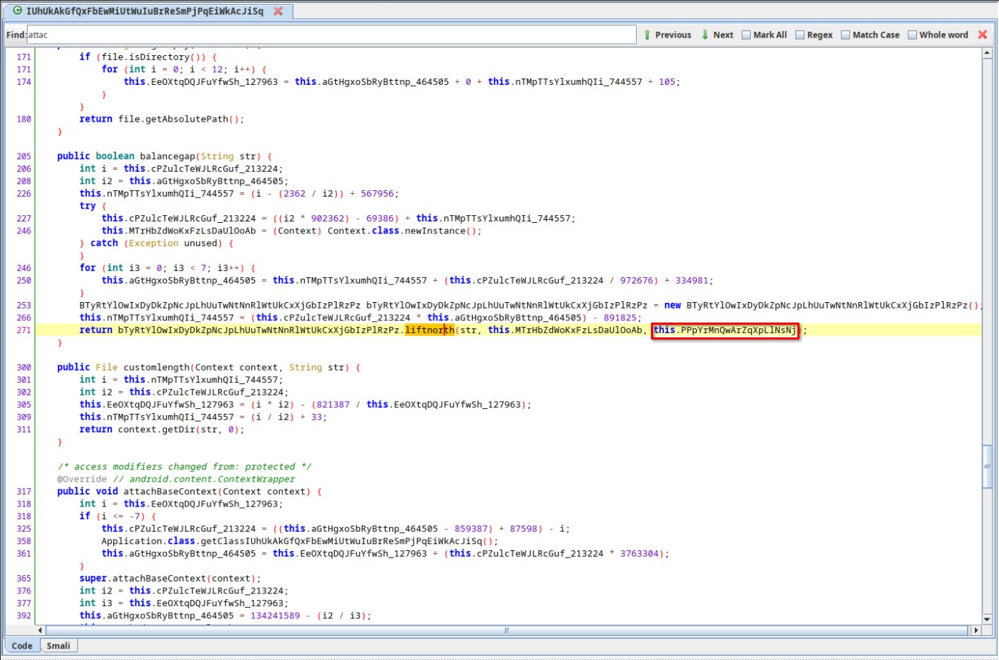

The function 2 above the `attachBaseContext(Context context)` function is the unpack function used in this common packer :D

In addition, in this common packer type, the `PPpYrMnQwArZqXpLlNsNj` variable I marked in the above contains the name of the file to be decrypted.

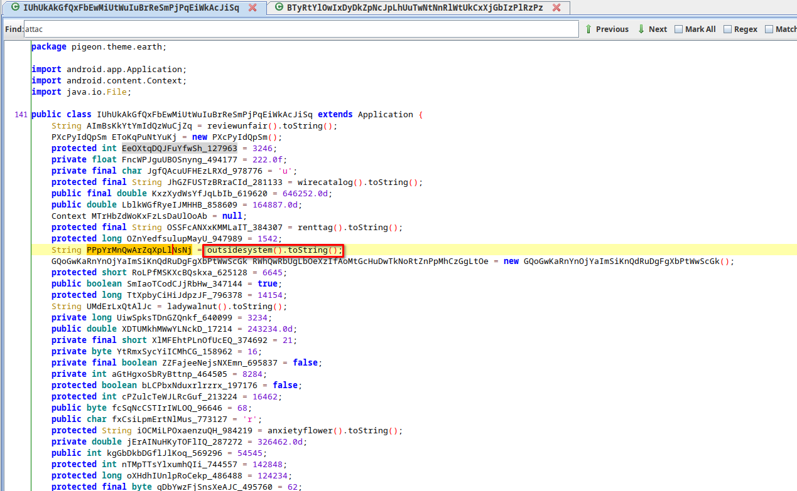
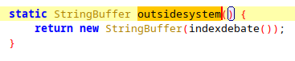
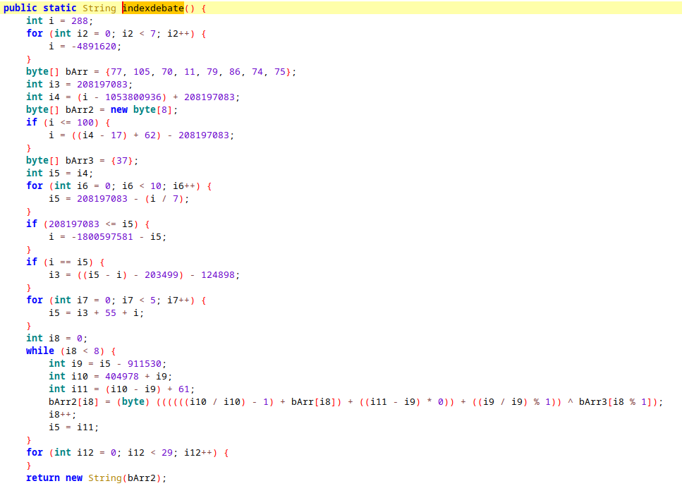
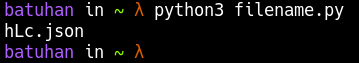

**Name Of Encryted Dex** = `hLc.json`


**_RC4_** is used when decrypting the class to be loaded in this packer type. So it's time to find the **_RC4_** key. When we go to the class with the `liftnorth` function, our goal is to find the **_RC4_** implementation waiting for us. It would be a reasonable idea to call **_256%_** for this, but it tried to hide this process with a variable that holds **_256_** in the sample we examined.


The **_integer array_** built before the `for` loop starts contains our **_decryption key_**.


**RC4 KEY FOR LOADED CLASS** = `fCiUMm`


**GG !!!**

## Conclusion

Anubis is a malware that is worth examining in every aspect and is really impressive, this application that harms tens of thousands of android users with thousands of samples around the world, is a source for future android malware. I hope you liked my post, thanks for reading.


## References

* [https://eybisi.run/Mobile-Malware-Analysis-Tricks-used-in-Anubis/](https://eybisi.run/Mobile-Malware-Analysis-Tricks-used-in-Anubis/){:target="_blank"}

* [https://pentest.blog/n-ways-to-unpack-mobile-malware/](https://pentest.blog/n-ways-to-unpack-mobile-malware/){:target="_blank"}

* [https://twitter.com/LukasStefanko/status/1084728042927341569](https://twitter.com/LukasStefanko/status/1084728042927341569){:target="_blank"}

* [https://www.trendmicro.com/en_us/research/19/a/google-play-apps-drop-anubis-banking-malware-use-motion-based-evasion-tactics.html](https://www.trendmicro.com/en_us/research/19/a/google-play-apps-drop-anubis-banking-malware-use-motion-based-evasion-tactics.html)

* [https://securityintelligence.com/anubis-strikes-again-mobile-malware-continues-to-plague-users-in-official-app-stores/
](https://securityintelligence.com/anubis-strikes-again-mobile-malware-continues-to-plague-users-in-official-app-stores/
){:target="_blank"}
