## HTTP SECURITY HEADERS

Hyper Text Transfer Protocol (HTTP) is a protocol that enables the transmission of hypermedia documents (HTML) by communicating between the server and the client. During communication, some data exchanges are required. These data, which include server and client details, message size, type and cookies, are indicated by HTTP headers.

In the example below, we can see some HTTP headers used by the Twitter website.

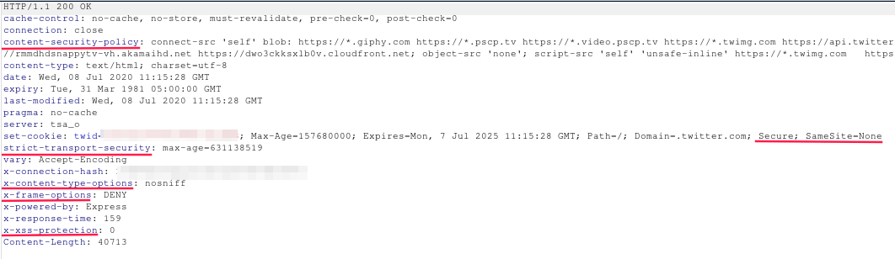

In the rest of the article, some security vulnerabilities and HTTP headers to help prevent them will be explained.

### X-XSS-PROTECTION

Developed to protect against Reflected XSS attacks by detecting and filtering out possible XSS payloads. However, it caused some security vulnerabilities such as disabling the frame buster mechanisms and being able to extract data from the page (For detailed information [see](https://medium.com/bugbountywriteup/xss-auditor-the-protector-of-unprotected-f900a5e15b7b)) . It is not supported in most current browsers.

#### Cross Site Scripting

Cross Site Scripting (XSS) is a vulnerability that allows an attacker to run arbitrary JavaScript code in the victim's browser.

**Usage**
- **0:** Disables filtering. 
- **1:** Enables filtering.
- **mode=block:** If XSS is detected, it prevents the page from loading.
- **report=https://example.com/xss.log:** If XSS is detected, it reports the attack attempt to the specified site. It is only used in Chromium-based browsers.

`X-XSS-Protection: 1; mode=block; report=https://example.com/xss.log`

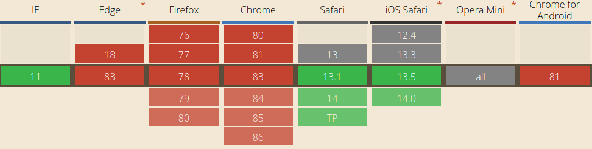

### X-Frame-Options

Checks whether the page can be called in an iframe. It provides protection against XSS attacks caused by postMessage method and clickjacking attacks.

#### Clickjacking

Clickjacking is a security vulnerability that allows an attacker to add another website within an iframe element to a seemingly harmless site, allowing the user to perform unwanted actions.

For example, the user thinks that he will win a gift and presses the button he sees on the screen. However, if the attacker puts a bank's money transfer page in the iframe, the victim actually confirms the payment as soon as they press the button. The browser also adds the victim's cookies to the request sent to the bank, and the money is transferred to the attacker. 

*PoC:* 
- The use of the ALLOW-FROM parameter, which is not supported in many browsers, caused a clickjacking vulnerability in Periscope. [https://hackerone.com/reports/591432](https://hackerone.com/reports/591432)

#### postMessage XSS

postMessage is a JavaScript method that allows a website to securely communicate with the iframe inside. If a code that will cause XSS vulnerability is written in the implementation of the method, the attacker can open the vulnerable page on his website in an iframe tag and perform an XSS attack.

*PoC:*
- In this example, if the https://platform.twitter.com page was not allowed to be loaded in an iframe by other sources, the XSS attack would not have occurred even though the code was vulnerable. [https://hackerone.com/reports/29328](https://hackerone.com/reports/29328)

**Usage**
- **DENY:** It is not allowed to be used in an iframe in any way.
- **SAMEORIGIN:** It only allows it to be used by the same domain.
- **ALLOW-FROM URL:** It only allows it to be used by the specified URL. Not supported in current browsers!

`X-Frame-Options: SAMEORIGIN`

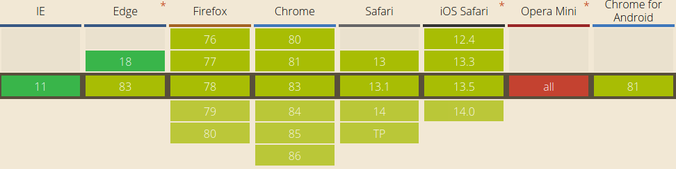

### X-Content-Type-Options

Makes the browser conform to the MIME type specified by the application. Provides protection against Mime Type Sniffing attacks.

#### Mime Type Sniffing

Mime Type Sniffing is when the browser tries to determine the type of the document by analyzing the content of the document in cases where Content-Type is not specified. It is not a type of vulnerability, but it can cause some attacks such as XSS.

For example, if any file containing HTML and JS codes is uploaded to an application that does not allow HTML file upload but does not specify Content-Type, the browser will consider this file as HTML file and XSS vulnerability will occur.

*PoC:*
- Uber's failure to use this header caused an XSS vulnerability on the mirror page where only `.tar.gz` files can be uploaded. [https://hackerone.com/reports/126197](https://hackerone.com/reports/126197)

**Usage**

`X-Content-Type-Options: nosniff`

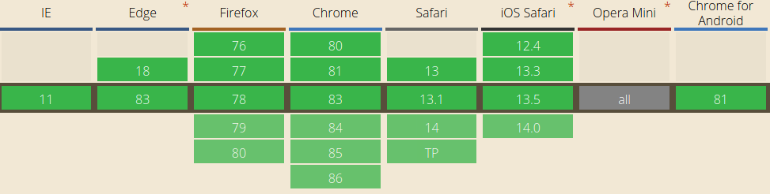

### HSTS (HTTP Strict Transport Security)

It ensures that the communication between the website and the browser takes place only over HTTPS. Provides protection against MITM attacks.

#### Man in The Middle

MITM attacks happen when an attacker eavesdrops on communication on the network. Because packets are not encrypted in HTTP connections, an attacker can capture sensitive data.

**Usage**
- **max-age:** Specifies the time, in seconds, that the feature will be kept in the browser's memory.
- **includeSubDomains:** Specifies that the feature will be applied to all subdomains.
- **preload:**  It allows the SSL certificate to be added to the default HSTS list of browsers. Thus, for the secure communication to begin, the first response to set the header is not awaited.

`Strict-Transport-Security: max-age=10886400; includeSubDomains; preload`

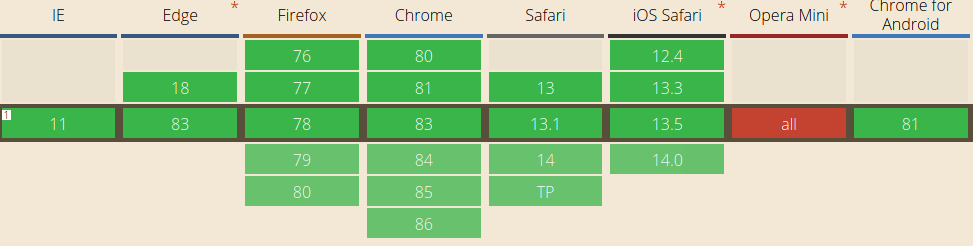

### Content-Security-Policy (CSP)

The CSP sets the sources from which website contents (JS codes, CSS files, images, etc.) are allowed to be loaded. It provides protection against attacks such as XSS, Clickjacking. With the CSP Evaluator application developed by Google, we can see the CSP rules applied by a website and their possible dangers.

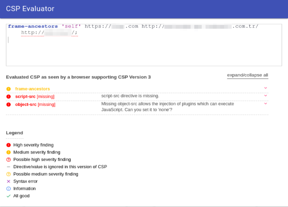

*PoC:*
- HackerOne's proper implementation of CSP rules prevents this attack -in non-IE browsers- even though the website has an XSS vulnerability. [https://hackerone.com/reports/474656](https://hackerone.com/reports/474656)

**Usage**
- **base-uri:** Restricts the URLs that can be used in the base element.
- **default-src:** Specifies a default value.
- **font-src:** Specifies resources to load using @font-face.
- **form-action:** Restricts URLs that can be used as form action.
- **frame-ancestors:** Specifies URLs that can *load* the page within the iframe element.
- **frame-src:** Specifies URLs that can be *loaded* with the iframe element inside the page.
- **img-src:** Specifies the sources from which images can be uploaded.
- **media-src:** specifies the sources of the media to be loaded using elements such as audio, video.
- **object-src:** Specifies the sources of the objects to be loaded using elements such as object, embed, applet.
- **report-uri:** Indicates the website to which the report will be sent when an attempt to violate the specified rules occurs.
- **script-src:** Specifies from which sources JavaScript codes can be loaded.
- **style-src:** Specifies from which sources style files can be loaded.
- **upgrade-insecure-requests:** Converts HTTP requests to HTTPS requests.

* **self:** Allows uploading from the same site only.
* **none:** Uploading from any source is not allowed.
* ***.example.com:** Allows loading from specified URLs and subdomains.

- Only some features are described above. For full list [see](https://developer.mozilla.org/en-US/docs/Web/HTTP/Headers/Content-Security-Policy#Directives)

`Content-Security-Policy: default-src 'self' https://example.com` 

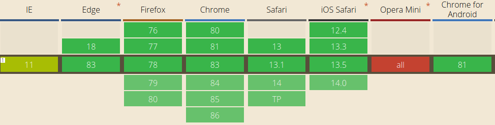

### Feature Policy

It sets the permissions to access the camera, microphone, sensors, and use of some of the following browser features by the page itself and the iframe element within the page.

**Usage** 

- **accelerometer:** Indicates the usage permission of the accelerometer sensor.
- **autoplay:** Indicates the autoplay feature of media.
- **camera:** Indicates the access authorization to the camera.
- **fullscreen:** Controls the use of Element.requestFullScreen().
- **geolocation:** Controls the user's access authorization to their location.
- **microphone:** Specifies the access authorization to the microphone.
- **picture-in-picture:** Controls the permission to play videos using the picture-in-picture feature.

* **self:** Allows only the site itself to use the specified feature.
* **none:** Does not allow the use of the feature.
* **\***: Allows the feature to be used by the site itself and the iframe windows it loads.
* **example.com:** Allows use of the feature by the specified website.

For full list [see](https://developer.mozilla.org/en-US/docs/Web/HTTP/Headers/Feature-Policy#Directives)

`Feature-Policy: camera 'self'; microphone 'none'; autoplay * `

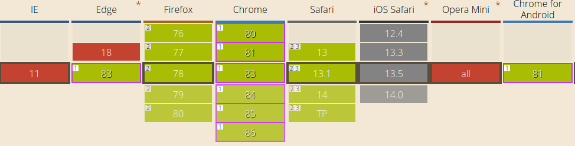

### Cross-Origin Resource Sharing (CORS) & Access-Control-Allow-Origin

Cross-origin resource sharing (CORS) is the mechanism by which some resources on a website can be used by a website of another origin (different domain, protocol or port). It is used for requests for Ajax calls (XMLHttpRequest and fetch API), canvas elements drawn with the `drawImage()` method, fonts called with @font-face in CSS and [WebGL texture](https://developer.mozilla.org/en-US/docs/Web/API/WebGL_API/Tutorial/Using_textures_in_WebGL) ewquests. It prevents the display of the content of pages containing sensitive data such as user profiles, preventing this data from being intercepted. Which origins are allowed is determined by the Access-Control-Allow-Origin header.

*PoC:*
- Misuse of this header by Twitter's niche.co site; led to the disclosure, modification, deletion of user information and theft of CSRF token. [https://hackerone.com/reports/426147](https://hackerone.com/reports/426147)

**Usage**

- ***:** Allows all resources for non-credential requests.
- **example.com:** Allows only requests from specified origins.
- **null:** Although used to indicate that no origins will be allowed, the use of null should be avoided as origin of resources specified as "data://" and "file://" can be null.

`Access-Control-Allow-Origin: https://example.com`

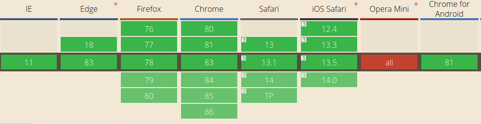

### Http Public Key Pinning

It is a security header that matches the encrypted key and the website. The key is determined on the first connection between the user and the server, and subsequent requests are expected to contain this key. If the wrong key is sent, the user is warned and if the "report-uri" feature is active, it will be reported to the specified URL. It was developed to prevent MiTM attacks through fake certificates. Currently not supported by current browsers. ([Why was it removed?](https://groups.google.com/a/chromium.org/forum/#!msg/blink-dev/he9tr7p3rZ8/eNMwKPmUBAAJ))

**Usage**
- **pin-sha256:** It is a base64 encoded [SPKI](https://ldapwiki.com/wiki/Subject%20Public%20Key%20Info) fingerprint.
- **max-age:** Specifies the time, in seconds, that the key will be kept in the browser's memory.
- **includeSubDomains:** Specifies that the key will be valid for all subdomains.
- **report-uri:** Pin verification errors are reported to the specified website.

`Public-Key-Pins: pin-sha256="Yjk0ZDI3Yjk5MzRkM2UwOGE1MmU1MmQ3ZGE3ZGFiZmFjNDg0ZWZlMzdhNTM4MGVlOTA4OGY3YWNlMmVmY2RlOQ=="; max-age=5184000; includeSubDomains; report-uri="https://example.com/hpkp-report"`

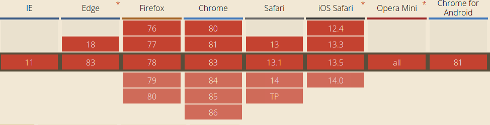

## COOKIE FLAGS

HTTP cookies are small data stored in the user's browser. It is often used to track sessions and remember the user's preferences. There are some parameters that must be added to the cookies to ensure the security of these cookies.

- **HttpOnly:** A cookie set to HttpOnly is only sent to the server, it cannot be accessed by JavaScript (document.cookie). It prevents authentication cookies from being compromised by an XSS attack.
  - Amazon's failure to use this parameter has caused account takeover vulnerability. https://medium.com/@adam.adreleve/advanced-javascript-injections-amazon-xss-to-full-account-takeover-c1559e1c43ad

- **Secure:**  It ensures that cookies are sent to the server only in HTTPS requests. Because HTTPS requests send encrypted data, an attacker listening to the network is prevented from hijacking cookies.

- **SameSite:** Sets whether cookies are included in third-party requests.
  - **None:** Allows cookies to be added to all third-party requests. It must be used with the `secure` attribute.
  - **Strict:** does not allow cookies to be inserted into any third party requests.
  - **Lax:** Adds cookies only to requests that will cause a top level change. That is, if the sent request takes you to a page other than the one you are on, cookies are added to the request. An example is requests sent with the `<a href>` tag. Cookies are not added to requests sent using the Ajax method or ` <iframe>` tags.

`Set-Cookie: sessionid=xAeeEjJyvOA0eCaD1qUFmCT3cfYxc9Tp8q1bonFtoVB10pDCx5GC6iw9I5nY8FXNAWZHEA; HttpOnly; Secure; SameSite=Strict`

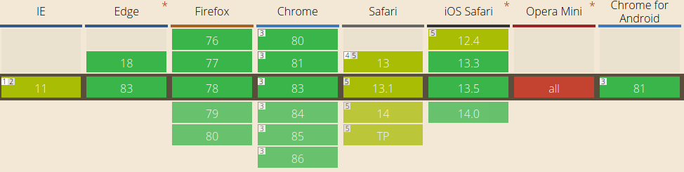

**As a result,** taking these small but effective measures can improve the security of our website and protect us and our users from vulnerabilities.

##### REFERENCES

- [https://www.mehmetince.net/http-security-headerlari-neden-ve-nasil-kullanilmalidir/](https://www.mehmetince.net/http-security-headerlari-neden-ve-nasil-kullanilmalidir/)
- [https://developer.mozilla.org/en-US/docs/](https://developer.mozilla.org/en-US/docs/)
- [https://www.netsparker.com.tr/blog/web-guvenligi/](https://www.netsparker.com.tr/blog/web-guvenligi/)
- [https://nullsweep.com/http-security-headers-a-complete-guide/](https://nullsweep.com/http-security-headers-a-complete-guide/)
- [https://tr.wikipedia.org/wiki/K%C3%B6kler_Aras%C4%B1_Kaynak_Payla%C5%9F%C4%B1m%C4%B1#%C4%B0stek_ba%C5%9Fl%C4%B1klar%C4%B1](https://tr.wikipedia.org/wiki/K%C3%B6kler_Aras%C4%B1_Kaynak_Payla%C5%9F%C4%B1m%C4%B1#%C4%B0stek_ba%C5%9Fl%C4%B1klar%C4%B1)
- [https://caniuse.com/](https://caniuse.com/)